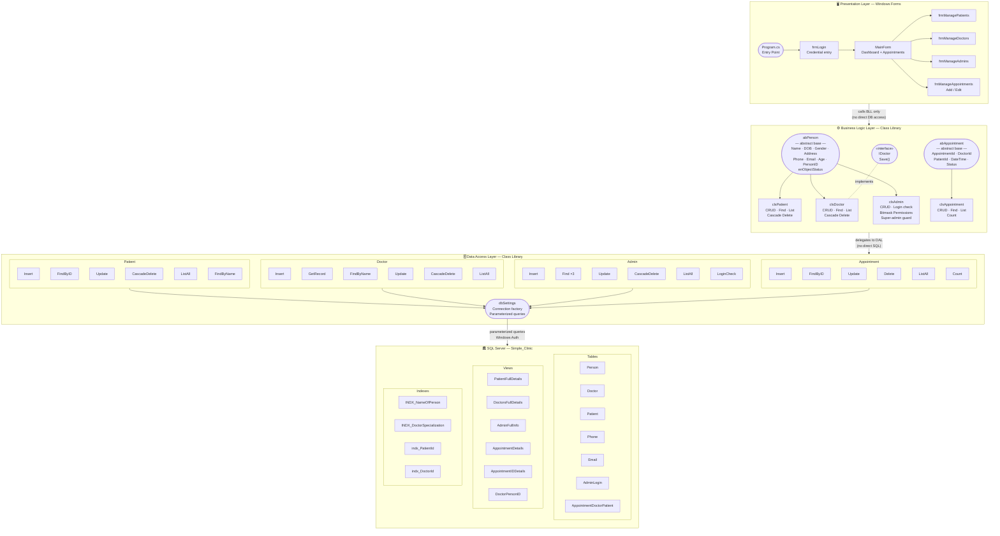
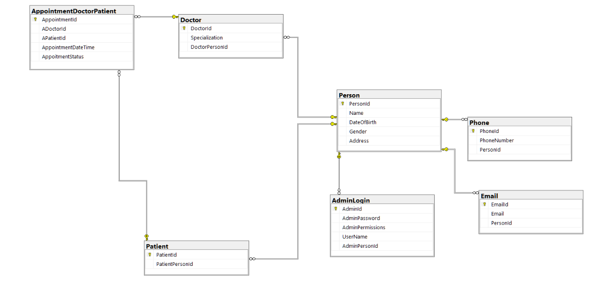

# Clinic Management System — Full Technical Documentation

> **Project Stack:** C# · Windows Forms · SQL Server (`Simple_Clinic` database)
> **Architecture Pattern:** Three-Tier (Presentation → Business Logic → Data Access)
> **Scope:** Person management (Doctors, Patients, Admins) and Appointment scheduling.

---
# Demo :


https://github.com/user-attachments/assets/ac951df7-68da-40d8-a1bf-2604fa8a1703


---
## Table of Contents

1. [Project Overview](#1-project-overview)
2. [Architecture Diagram](#2-architecture-diagram)
3. [System Architecture — The Three Tiers](#3-system-architecture--the-three-tiers)
   - [Presentation Layer](#31-presentation-layer)
   - [Business Logic Layer](#32-business-logic-layer)
   - [Data Access Layer](#33-data-access-layer)
4. [Database Design](#4-database-design)
   - [Original Schema (Project 1)](#41-original-schema-project-1--simple-clinic)
   - [Schema Evolution](#42-schema-evolution--new-additions-made-for-this-application)
   - [Table Reference](#43-table-reference)
   - [Relational Schema](#44-relational-schema)
   - [Database Views (In Depth)](#45-database-views-in-depth)
   - [Indexes & Performance Optimization](#46-indexes--performance-optimization)
   - [Constraints & Data Integrity](#47-constraints--data-integrity)
5. [OOP Design & Class Hierarchy](#5-oop-design--class-hierarchy)
6. [Features Built](#6-features-built)
7. [Input Validation Strategy](#7-input-validation-strategy)
8. [Permission System](#8-permission-system)
9. [Application Flow](#9-application-flow)
10. [Key Design Decisions](#10-key-design-decisions)

---

## 1. Project Overview

The Clinic Management System is a desktop Windows Forms application built on top of the **Simple Clinic** SQL Server database. It provides a role-based administrative interface for clinic staff to manage doctors, patients, and appointments.

The project deliberately narrows scope to what matters most for daily clinic workflow:

| Area | Status |
|---|---|
| Person management (Doctor, Patient, Admin) | ✅ Implemented |
| Appointment scheduling & tracking | ✅ Implemented |
| Admin login & role-based permissions | ✅ Implemented |
| Payment tracking | ❌ Out of scope |
| Medical records | ❌ Out of scope |
| Prescriptions | ❌ Out of scope |

This scoping decision is documented in the project's `note.txt`:
> *"Payment will be ignored. Medical Record will be ignored. Prescription will be ignored. The system will handle only the person details (doctor, patient) and appointments."*

---

## 2. Architecture Diagram



The diagram shows the strict three-tier flow: the **Presentation Layer** only calls the BLL; the **BLL** owns all rules and lifecycle logic and calls the DAL; the **DAL** executes parameterized SQL against the database. No layer ever bypasses the one below it.

---

## 3. System Architecture — The Three Tiers

### 3.1 Presentation Layer

The Presentation Layer is a set of Windows Forms. Each form is responsible only for **displaying data** and **capturing user input**. No SQL, no business rules, no database calls live here. When the user takes an action, the form delegates to the Business Logic Layer and only handles the result.

#### Entry Point and Startup Loop

The application launches through `Program.cs`. Rather than having one fixed startup form, it runs a loop: the **Login form** is shown first, and only a successful login opens the **Main Dashboard**. When the user logs out, the loop brings the Login form back. This allows switching accounts without restarting the application.

```
Application starts
      │
      ▼
  [Login Screen shown]
      │── User cancels → application exits
      │── Login succeeds ──────────────────▶ [Main Dashboard shown]
      │                                              │
      │◀──────────────── User clicks Logout ─────────┘
```

#### Forms

| Form | Purpose |
|---|---|
| Login Screen | Where staff enter their credentials to access the system |
| Main Dashboard | Central hub — shows all appointments, and provides navigation to all management areas |
| Manage Patients | Full patient lifecycle management (add, view, edit, delete) |
| Manage Doctors | Full doctor lifecycle management |
| Manage Admins | Admin account creation, permission assignment, editing, and deletion |
| Manage Appointments | Focused form for adding or editing a single appointment |

#### Shared UI Patterns Across All Management Forms

All management forms follow the same interaction pattern:

1. A **data grid** shows all records when the form opens and refreshes automatically after any change.
2. **Input controls** (text fields, date pickers, dropdowns) are live-bound — as the user types or selects, the backing business object is updated in real time.
3. A **right-click context menu** on any grid row exposes Edit and Delete.
4. The form switches **visually between Add and Edit mode** — the Add button disappears and a Save Changes button appears. The form title also changes (e.g., "Editing Existing Doctor") to make the current mode obvious.
5. All **destructive actions require confirmation** via a dialog before executing.

---

### 3.2 Business Logic Layer

The BLL is a dedicated C# project (class library). It owns all **business rules**, all **object lifecycle management**, and all **orchestration** of read/write operations. The Presentation Layer only ever talks to this layer.

The BLL defines **four entity classes** — one per domain concept — plus two abstract base classes and an interface that express what these entities have in common.

#### The Abstract Base: What Every Person Shares

All person-type entities (patients, doctors, admins) inherit from a common abstract base that centralizes the shared personal data they all carry: full name, date of birth, gender, address, phone number, email address, and a computed age. The Person ID — the database key that links all related tables — is protected so it can only be set from within the class hierarchy, preventing the presentation layer from ever tampering with identity keys.

#### The Object Lifecycle Pattern

Every entity class tracks its own state — whether it represents a **brand new** object being created, or an **existing** one being edited. The rules are:

- When a form creates a new empty object to fill in (e.g., "Add New Patient"), the object starts in **Add mode**.
- When the system loads an existing record from the database to edit it, the object switches to **Update mode**.
- Calling `Save()` on the object routes automatically to the correct database operation (insert or update) based on this internal mode — the form never needs to know which one.

This keeps the forms simple and consistent. Every form calls the same `Save()` regardless of whether it is creating or editing.

#### Patient Entity

Manages all patient records. Supports loading a patient by their Person ID or their Patient ID, searching by name, listing all patients, saving changes, and full deletion. Deletion is a cascade — it removes the patient's phone, email, appointment records, patient role record, and finally their person record in the correct order to satisfy foreign key constraints.

The patient's primary handle throughout the application is **PersonId**, not PatientId. This is intentional: since the `Person` table is the root of all personal information, using PersonId means any operation (edit, delete, lookup) can reach all related tables without an extra join.

#### Doctor Entity

Mirrors the patient entity in structure, with the addition of a **Specialization** field. All the same lifecycle operations apply. Deletion cascades identically: phone → email → appointments → doctor record → person record.

The doctor entity implements the `IDoctor` interface, which enforces that any doctor object in the system must be persistable. This is an OOP contract.

#### Admin Entity

Extends the person base with three extra pieces of data: a **username**, a **password**, and a **permissions integer**. It adds credential-checking logic (used at login) and the full bitmask permission system for controlling what each admin can do. See Section 8 for the permission system detail.

A hard-coded guard prevents the super admin account from being modified — the BLL itself rejects the update if the target is the designated super admin's PersonId.

#### Appointment Entity

Manages the booking of appointments between a specific doctor and a specific patient at a given date/time, with a status value. It supports listing all appointments, fetching a single appointment by ID (for editing), adding, updating, and deleting. It also provides a quick count of total appointments for the dashboard counter.

---

### 3.3 Data Access Layer

The DAL is a second dedicated C# project. Every class in it handles **exactly one database operation**. This makes the data access layer a collection of focused, single-purpose workers — easy to locate and change without risk of affecting anything else.

#### Connection Management

A single internal settings class holds the database connection configuration. Every DAL class uses this central factory to get a database connection. The connection string is defined in exactly one place and never repeated.

The connection lifecycle is consistent across all DAL classes:
- Open connection
- Execute the operation
- Always close in a `finally` block, even if an error occurs

This guarantees no connection leaks regardless of what happens during execution.

#### SQL Injection Prevention

Every query in the DAL uses **parameterized commands** — values are never concatenated into SQL strings. This applies to all 24 DAL classes without exception.

#### DAL Classes by Domain

| Domain | Classes | What they handle |
|---|---|---|
| Patient | 6 classes | Insert, find by ID, update, cascade delete, list all, find by name |
| Doctor | 6 classes | Insert, get record, find by name, update, cascade delete, list all |
| Admin | 6 classes | Insert, find (by 3 different keys), update, cascade delete, list all, login check |
| Appointment | 6 classes | Insert, find by ID, update, delete, list all, count total |

---

## 4. Database Design

### 4.1 Original Schema (Project 1 — Simple Clinic)

**Project location:** `d:\Self-Study\Db\Db Projects\Project 1 – Simple Clinic\`

The database was originally designed as a complete clinic data model. The design files are:

- `DDL.sql` — creates all tables, keys, and constraints
- `DML.sql` — inserts sample records for testing
- `Index.sql` — creates performance indexes
- `Views.sql` — creates reporting and lookup views

#### The IS-A Design Pattern

The core architectural decision of the schema is the **IS-A (inheritance) pattern**:

- `Doctor` IS-A `Person` — the Doctor table holds only doctor-specific data (Specialization) and links to Person for everything else.
- `Patient` IS-A `Person` — same pattern.
- `AdminLogin` IS-A `Person` (added for this application) — same pattern.

This avoids data duplication. A person's name, address, gender, and date of birth are stored once in `Person`, regardless of how many roles they hold.

Phone numbers and email addresses are stored in separate tables (`Phone`, `Email`) each pointing back to `Person`. This models the real-world fact that a person can have multiple phone numbers or email addresses.

#### Original Full Schema

The original design included tables for `MedicalRecord`, `Prescription`, `Payment`, and `Appointment` (which referenced all four of those). These tables exist in the database but the application does not interact with them in this phase.

---

### 4.2 Schema Evolution — New Additions Made for This Application

The `Sql Queries/` folder contains all SQL written during development of the application. These additions evolved the database from the academic design into a functional system.

#### New Table: `AdminLogin`

A completely new table was created to support the role-based authentication system:

| Column | Type | Notes |
|---|---|---|
| `AdminId` | int identity | Primary key |
| `AdminPassword` | varchar(10) | Admin's password |
| `AdminPermissions` | int | Bitmask of granted permissions |
| `UserName` | varchar(10) UNIQUE | Login username |
| `AdminPersonId` | int FK → Person | Links this admin to their Person record |

The `AdminPersonId` foreign key was added after the initial table creation, connecting every admin to a full personal profile in the system.

#### New Appointment Table: `AppointmentDoctorPatient`

The original `Appointment` table referenced Payment and MedicalRecord — neither of which this application manages. A new, focused table was created instead:

| Column | Type | Notes |
|---|---|---|
| `AppointmentId` | int identity PK | |
| `ADoctorId` | int FK → Doctor | The attending doctor |
| `APatientId` | int FK → Patient | The patient |
| `AppointmentDateTime` | datetime | Default: current date/time |
| `AppoitmentStatus` | varchar(50) | Default: `'NoShow'` |

Two **default constraints** were added so that appointments created without explicit values still have sensible defaults:
- `DefaultAppointmentStatus` → `'NoShow'`
- `DefaultDateTime` → `GetDate()` (current server time)

A **composite unique constraint** prevents the same doctor from having two identical appointments with the same patient at the same moment:
```
UNIQUE (ADoctorId, APatientId, AppointmentDateTime, AppoitmentStatus)
```

#### Unique Constraint on Person Records

```sql
UNIQUE(Name, DateOfBirth, Gender, Address)
```

This prevents the same person from being registered twice. The combination of all four identity fields acts as a natural deduplication key. This constraint is also what makes the multi-step INSERT pattern reliable — after inserting a Person row, the system can immediately look it up by these four fields to get the new PersonId.

A further constraint enforces that **names are globally unique** across all persons, simplifying name-based lookups in the appointment booking form.

---

### 4.3 Table Reference

The tables actively used by the application:

| Table | Purpose | Key Relationship |
|---|---|---|
| `Person` | Central identity store — name, DOB, gender, address | Root of the IS-A hierarchy |
| `Phone` | Phone numbers | Each belongs to one Person |
| `Email` | Email addresses | Each belongs to one Person |
| `Doctor` | Doctor-specific data (Specialization) | IS-A Person via `DoctorPersonId` |
| `Patient` | Patient role marker | IS-A Person via `PatientPersonId` |
| `AdminLogin` | Admin credentials and permissions | IS-A Person via `AdminPersonId` |
| `AppointmentDoctorPatient` | Appointment records | Links Doctor and Patient |

---

### 4.4 Relational Schema

The diagram below shows the implemented relational schema — the subset of the original Simple Clinic design that is active in this application. It reflects all structural changes made during development: the renamed FK columns (`DoctorPersonId`, `PatientPersonId`), the new `AdminLogin` table linked to `Person`, and the new `AppointmentDoctorPatient` table replacing the original `Appointment` table.



**Reading the diagram:**
- **Gold key icon (🔑)** — primary key column
- **Crow's foot lines** — one-to-many relationships; the crow's foot end is the "many" side
- `Person` sits at the center because it is the root of the IS-A hierarchy — every other entity (Doctor, Patient, AdminLogin) points back to it
- `Phone` and `Email` each have their own one-to-many relationship with `Person`, reflecting the fact that a person can have multiple contact entries
- `AppointmentDoctorPatient` connects to `Doctor` and `Patient` (not directly to `Person`), because appointments are booked between role entities, not raw persons

---

### 4.5 Database Views (In Depth)

Views are the **primary data source for all read operations** in this application. Instead of writing complex JOINs in every DAL class, views pre-define the joined result and the DAL simply queries the view. This keeps DAL queries short and ensures JOIN logic is defined once and reused everywhere.

---

#### `PatientFullDetails`

**What it joins:** `Patient → Person → Email → Phone`

**Columns returned:**
`PersonId, Name, Email, PhoneNumber, Gender, DateOfBirth, Address`

**Purpose:** Presents a complete, human-readable patient record by combining the patient's role data with their personal identity and contact information.

**Who uses it:**
- The **Patient BLL class** queries this view whenever it loads a patient record to display or edit. When a staff member opens the patient management screen, every row in the grid comes from this view.
- The **Patient BLL class** also queries this view during name-based search (used in the appointment form when the staff picks a patient by name — the view returns the PersonId needed to identify them).
- The **DAL layer** always reads patients through this view rather than joining the raw tables directly.

---

#### `DoctorsFullDetails`

**What it joins:** `Doctor → Person → Email → Phone`

**Columns returned:**
`DoctorId, PersonId, DoctorName, DateOfBirth, Gender, Address, Specialization, PhoneNumber, Email`

**Purpose:** Combines the doctor's specialization with their personal profile and contact details into one flat record.

**Who uses it:**
- The **Doctor BLL class** reads this view for all doctor lookups — whether finding a doctor by PersonId, by DoctorId, or by name.
- The **Appointment form** reads this view to populate the doctor selection dropdown (it pulls all doctor names and resolves the selected name back to a DoctorId for storage).
- When the appointment edit form loads an existing appointment, it reads this view to display the doctor's name given only their DoctorId stored in the appointment record.
- The **dashboard appointment grid** also references this view indirectly through `AppointmentDetails`.

---

#### `AdminFullInfo`

**What it joins:** `Person → AdminLogin → Email → Phone`

**Columns returned:**
`PersonId, AdminId, UserName, AdminPassword, AdminPermissions, Name, DateOfBirth, Gender, Address, Email, PhoneNumber`

**Purpose:** Surfaces a complete admin profile including credentials and permissions alongside the personal data stored in `Person`.

**Who uses it:**
- The **Admin BLL class** queries this view for every admin lookup: finding by PersonId, by AdminId, and by username.
- After a successful login, the dashboard immediately queries this view by username to load the full admin object into memory for the session. Every permission check throughout the session uses the `AdminPermissions` value retrieved from this view at load time.
- The admin management grid on the `frmManageAdmins` form is sourced entirely from this view.

---

#### `AppointmentDetails`

**What it joins:** `AppointmentDoctorPatient → DoctorsFullDetails → PatientFullDetails`

**Columns returned:**
`AppointmentId, DateAndTime, DoctorName, Specialization, DoctorPhoneNum, DoctorGender, PatientName, PatientPhoneNum, PatientAge, AppoitmentStatus`

**Purpose:** The richest view in the system — it assembles everything a staff member needs to see about an appointment in one row: who the doctor is, who the patient is, when the appointment is, and its current status. Instead of showing raw IDs, the grid shows readable names, phone numbers, and the patient's computed age.

**How patient age is computed inside the view:**
```sql
PatientAge = Year(GetDate() - CAST(PatientFullDetails.DateOfBirth AS datetime))
```
Age is never stored in the database — it is always calculated fresh from the date of birth at query time.

**Who uses it:**
- The **main dashboard grid** is sourced entirely from this view. Every appointment row the staff sees comes from here.
- The **Appointment BLL class** reads this view when listing all appointments for the dashboard.
- Because this view already joins doctor and patient details, the dashboard never needs to make secondary queries to resolve names or contact info.

---

#### `AppointmentIDDetails`

**What it returns:** `AppointmentId, PatientId (as APatientId), DoctorId (as ADoctorId)`

**Purpose:** A lightweight view that exposes only the raw IDs from the appointment table, without the expensive join to person details. Used internally when the system needs to resolve or verify IDs without pulling full profiles.

**Who uses it:**
- Used internally during deletion and lookup operations where only the IDs matter, not the human-readable names.

---

#### `DoctorPersonID`

**What it returns:** The Doctor's `PersonId` (aliased as `DocID`) for every doctor in the system.

**Purpose:** A helper view that lets the delete operation locate a doctor's Person row by PersonId through a clean view reference, rather than joining `Doctor` and `Person` inline inside the delete query.

**Who uses it:**
- The **Doctor deletion logic** queries this view to confirm a PersonId is valid as a doctor before proceeding with the cascade delete. All four sub-deletes in the cascade (Phone, Email, Appointment, Doctor) reference this view to locate the correct rows.

---

### 4.6 Indexes & Performance Optimization

Indexes were added at two stages of the project.

**From the original Simple Clinic database:**

| Index | Table | Indexed Columns | Why |
|---|---|---|---|
| `INDX_NameOfPerson` | `Person` | `Name, Gender` | Supports fast name-based lookups across all person searches |
| `INDX_DoctorSpecialization` | `Doctor` | `Specialization` | Allows filtering doctors by their field of practice |
| `INDX_AppointmentStatus` | `Appointment` (original) | `AppoitmentStatus, DoctorId, PatientId, MedicalRecordId` | Covering index for appointment status queries |

**Added during application development:**

| Index | Table | Indexed Columns | Why |
|---|---|---|---|
| `indx_PatientId` | `AppointmentDoctorPatient` | `APatientId` | When deleting a patient, the system must delete all their appointments first. Without this index, SQL Server scans the entire appointment table. With it, it jumps directly to matching rows. |
| `indx_DoctorId` | `AppointmentDoctorPatient` | `ADoctorId` | Same reason — cascade delete for doctors scans by doctor ID |
| `Indx_PatientIDForPatientTable` | `Patient` | `PatientPersonId` | Speeds up the IS-A join between Patient and Person on every patient query |
| `Indx_DoctorIDForDoctorTable` | `Doctor` | `DoctorPersonId` | Speeds up the IS-A join between Doctor and Person on every doctor query |

The four new application-level indexes directly support the two most performance-sensitive operations: **cascade deletes** and **IS-A joins**. Both happen on every single patient/doctor read and write.

---

### 4.7 Constraints & Data Integrity

| Constraint | Type | What it enforces |
|---|---|---|
| Primary keys on all tables | PK | Every row has a unique identity |
| FK from `Phone.PersonId` → `Person` | FK | Phone numbers cannot exist without a person |
| FK from `Email.PersonId` → `Person` | FK | Emails cannot exist without a person |
| FK from `Doctor.DoctorPersonId` → `Person` | FK | Doctors must be real persons |
| FK from `Patient.PatientPersonId` → `Person` | FK | Patients must be real persons |
| FK from `AdminLogin.AdminPersonId` → `Person` | FK | Admin accounts must be linked to a person |
| FK from appointment to Doctor and Patient | FK | Appointments reference real doctors and patients |
| `CHK_AppointmentStatus` | Check | Status can only be: `Pending, Confirmed, Completed, Cancelled, Rescheduled, NoShow` |
| `UQ_PersonRecord` on `(Name, DOB, Gender, Address)` | Unique | No two identical person registrations |
| `UQ_Name` on `Person.Name` | Unique | Names must be unique |
| `UQ_Username` on `AdminLogin.UserName` | Unique | No two admins share a username |
| `UQ_Record` on `(DoctorId, PatientId, DateTime, Status)` | Unique | No duplicate appointments |
| `DefaultAppointmentStatus` → `'NoShow'` | Default | Appointments have a status even if not specified |
| `DefaultDateTime` → `GetDate()` | Default | Appointments have a timestamp even if not specified |

---

## 5. OOP Design & Class Hierarchy

```
abPerson (abstract base — shared person identity)
├── clsPatient    (patient role + patient operations)
├── clsDoctor     (doctor role + doctor operations) ──implements──▶ IDoctor
└── clsAdmin      (admin role + permission management)

abAppointment (abstract base — shared appointment fields)
└── clsAppointment (appointment lifecycle management)
```

#### The Add/Update Mode Pattern

This is the central OOP design pattern used across all BLL entities. Every object knows whether it is a new record being created or an existing one being modified:

- **Add mode:** Created when a form starts a fresh entry. Calling `Save()` performs an INSERT.
- **Update mode:** Created only when loading an existing record from the database (via a find/get operation). Calling `Save()` performs an UPDATE.

The form never has to decide which database operation to call — it always calls `Save()` and the object handles the routing. After a successful add, the object automatically switches itself to Update mode, so calling `Save()` again will correctly update rather than insert a duplicate.

#### Why PersonId Is the Primary Handle

Throughout the application, doctors, patients, and admins are tracked by their **PersonId**, not their role-specific ID (DoctorId / PatientId / AdminId). Reasons:

- `Person` is the root of all personal data. All reads, updates, and deletes start from the Person row.
- When a row is selected in a management grid, the first column is PersonId — available immediately for any operation.
- Cascade deletion requires the PersonId to be known last (Person is deleted last). Tracking by PersonId means no extra lookup is needed at deletion time.
- DoctorId is only needed in one specific context: storing appointments. Everywhere else, PersonId is the correct key.

---

## 6. Features Built

### Login & Session Management

Staff log in with a username and password. The system checks the credentials against the `AdminLogin` table. On success, the staff member's full admin profile — including their permission settings — is loaded into memory for the entire session. Every action from that point forward is checked against their permissions. Whitespace is automatically trimmed from credentials before checking, preventing failures due to accidental spaces.

Logging out returns to the login screen. The application stays running; no restart is needed to switch accounts.

---

### Dashboard

The main screen after login shows a live grid of all appointments in the system, sorted oldest-first. A summary counter shows the total number of appointments. From this screen, staff can navigate to patient, doctor, and admin management (subject to their permissions). Appointments can also be added, edited, and deleted directly from this screen via a right-click context menu.

---

### Patient Management

- **View all patients** in a searchable data grid powered by the `PatientFullDetails` view.
- **Search by Person ID** — the grid narrows in real time as the ID is typed.
- **Add a new patient** — staff fill in name, date of birth, gender, address, email, and phone. The system validates all fields before attempting to save. On success, the patient is written to four tables simultaneously: Person, Patient, Email, and Phone.
- **Edit an existing patient** — selecting Edit from the right-click menu loads the patient's current data into the form. Changes to any field are saved back to all relevant tables at once.
- **Delete a patient** — after confirmation, the system removes the patient's records in strict order to respect foreign key constraints: phone → email → appointments → patient record → person record. All of this happens in one database operation.

---

### Doctor Management

Identical feature set to patient management, with the addition of a **Specialization** field. The same add/edit/delete/search lifecycle applies. Deletion cascades in the same order as patients.

---

### Admin Management

- **View all admins** in a grid sourced from the `AdminFullInfo` view.
- **Add a new admin** — same personal details as any person (name, DOB, gender, address, email, phone) plus a unique username, password, and permission selection.
- **Edit an existing admin** — loads current data including current permission checkboxes.
- **Permission management** — checkboxes for each of the four permission categories control what the admin can access. Checking or unchecking a box updates the bitmask in real time.
- **Delete an admin** — cascade removes phone, email, admin login record, and person record.
- **Super admin protection** — the designated super admin cannot be edited or deleted. This is enforced at the BLL level (the save is blocked) and at the UI level (an error is shown before any operation begins).
- **Search by Person ID** — live search narrows the grid.

---

### Appointment Management

Appointments are managed from the main dashboard via a right-click context menu on the appointment grid.

- **Add a new appointment** — a focused dialog opens. Staff select the doctor and patient from dropdowns (populated with all registered names), pick a date and time, and choose a status. Submitting saves the appointment.
- **Edit an existing appointment** — the same dialog opens pre-filled with the appointment's current values. The doctor and patient names are resolved from their IDs and shown in the dropdowns. Any field can be changed and saved.
- **Delete an appointment** — a confirmation dialog appears. On confirmation, the appointment row is removed.
- The dashboard grid refreshes automatically after every add, edit, or delete.

---

## 7. Input Validation Strategy

Validation is applied in two layers before any data reaches the database.

### Layer 1 — The Form (Presentation)

Before calling Save, every management form runs its own check:

- Name, Address, Gender, Email, Phone must all be non-empty
- Date of birth must not be left at its default picker value, must not be `DateTime.MinValue`, and must not be today's date — the form's date picker also enforces a maximum of today (future birthdates are physically unselectable)
- Email is entered via a masked text box that enforces a valid format pattern; the form only accepts the value when the mask is fully completed

If any check fails, a warning message explains what is missing and the save is cancelled.

### Layer 2 — The Database

Even if data passes the form check, the database enforces its own rules:

- `NOT NULL` columns reject blank values
- `UNIQUE` constraints reject duplicate person records, duplicate usernames, and duplicate appointments
- The appointment status `CHECK` constraint rejects any status value not in the approved list
- Foreign key constraints prevent creating records that reference non-existent doctors, patients, or persons

These two layers together mean invalid data is rejected as early as possible (at the UI) and protected at the deepest level (at the database) as a final guarantee.

---

## 8. Permission System

Each admin account has a single integer stored in the database that encodes all of their permissions as a **bitmask** — a set of binary flags packed into one number.

| Permission | Value | Meaning |
|---|---|---|
| ManagePatients | 2 | Can open and use the Patients screen |
| ManageDoctors | 4 | Can open and use the Doctors screen |
| ManageAppointments | 8 | Can add, edit, and delete appointments from the dashboard |
| ManageAdmins | 16 | Can open and use the Admins screen |

An admin with all four permissions has a stored value of `2 + 4 + 8 + 16 = 30`.

**Granting a permission** uses a bitwise OR operation — it sets the specific bit without disturbing any others.

**Revoking a permission** uses bitwise AND with the complement — it clears only that bit.

**Checking a permission** uses bitwise AND — if the result equals the permission value, the flag is set.

Every navigation button on the dashboard checks the logged-in admin's permission before opening a sub-form. Every appointment action (add, edit, delete) from the context menu also checks permission. If the check fails, a "Permission Denied" message is shown and no further action is taken.

---

## 9. Application Flow

### Startup & Login

```
Program launches
  └─ Login screen shown
       └─ Staff enters username and password
       └─ System checks credentials against AdminLogin table
            │── Wrong credentials → error message, stay on login screen
            └── Correct → Main Dashboard opens
                  └─ Admin's full profile (including permissions) loaded from AdminFullInfo view
                  └─ All appointments loaded from AppointmentDetails view into dashboard grid
```

### Adding a New Person (Patient / Doctor / Admin)

```
Staff fills the form and clicks Add
  └─ Form validates all fields
       │── Validation fails → warning shown, nothing saved
       └── Validation passes → BLL object Save() called
            └─ Four tables written in sequence:
                 1. INSERT into Person
                 2. INSERT into role table (Patient / Doctor / AdminLogin)
                    └─ Uses PersonId just created, looked up by the unique (Name, DOB, Gender, Address) combination
                 3. INSERT into Email
                 4. INSERT into Phone
            └─ Success → confirmation shown, grid refreshes
            └─ Failure → error shown, no partial data left
```

### Deleting a Record (Patient or Doctor)

```
Staff right-clicks a grid row → Delete
  └─ Confirmation dialog
       │── Cancelled → nothing happens
       └── Confirmed → cascade delete in strict order:
            1. Delete Phone row(s) for this person
            2. Delete Email row(s) for this person
            3. Delete all Appointments linked to this person
            4. Delete the Doctor / Patient role record
            5. Delete the Person record (last — it is referenced by all others)
       └─ Success → confirmation shown, grid refreshes
```

The Person row must always be deleted last because every other table references it via foreign key. Attempting to delete Person first would violate those constraints and fail.

---

## 10. Key Design Decisions

### One DAL Class Per Operation

Each database operation (insert patient, delete patient, find patient by ID, etc.) lives in its own dedicated class. This means modifying how patient insertion works involves touching exactly one file with no risk of accidentally changing how deletion or searching works. The query text lives in the same class as the code that executes it — easy to read, easy to maintain.

### Views as the Read Layer

No DAL class performs multi-table JOINs inline. All read operations go through pre-defined views. This means JOIN logic is written once in SQL and reused by every query that needs it. If a JOIN needs to change (e.g., a new column is added to person details), only the view definition changes — all the DAL classes querying that view automatically reflect the change.

### Multi-Statement INSERT as a Single Batch

Adding a patient, doctor, or admin requires writing to four tables. Rather than making four separate round trips to the database, all four `INSERT` statements are sent as a single batch. At the end of the batch, `SCOPE_IDENTITY()` returns the ID of the last row created, allowing the BLL to confirm success. This is faster and reduces the window for partial failures.

The reason the batch can reliably link the subsequent rows back to the newly inserted Person is the `UQ_PersonRecord` unique constraint — the combination of `(Name, DateOfBirth, Gender, Address)` is guaranteed to be unique, so the sub-select that looks up the new PersonId will always find exactly one row.

### `SCOPE_IDENTITY()` Over `@@IDENTITY`

The batch uses `SCOPE_IDENTITY()` rather than `@@IDENTITY` to retrieve the newly generated ID. `@@IDENTITY` can be corrupted by triggers on related tables that happen to insert their own rows. `SCOPE_IDENTITY()` is scoped to the current batch and is always safe.

### Age Is Never Stored

The `Person` table stores only `DateOfBirth`. Age is calculated at runtime — in SQL inside the `AppointmentDetails` view, and from the data view result in the C# objects. This means the displayed age is always accurate without requiring any maintenance or scheduled updates to a stored value.

### Super Admin Is a Hard-Coded Guard

PersonId=9 is designated as the super admin. The BLL rejects any update targeting this PersonId. The UI also surfaces a clear message before even attempting the operation. This two-level guard ensures the foundational admin account cannot be accidentally locked out or modified.

### Memory Management

All sub-forms are explicitly disposed after use to release resources. The main dashboard form is reused across login sessions rather than being recreated each time, keeping the logout/re-login cycle fast.

----
